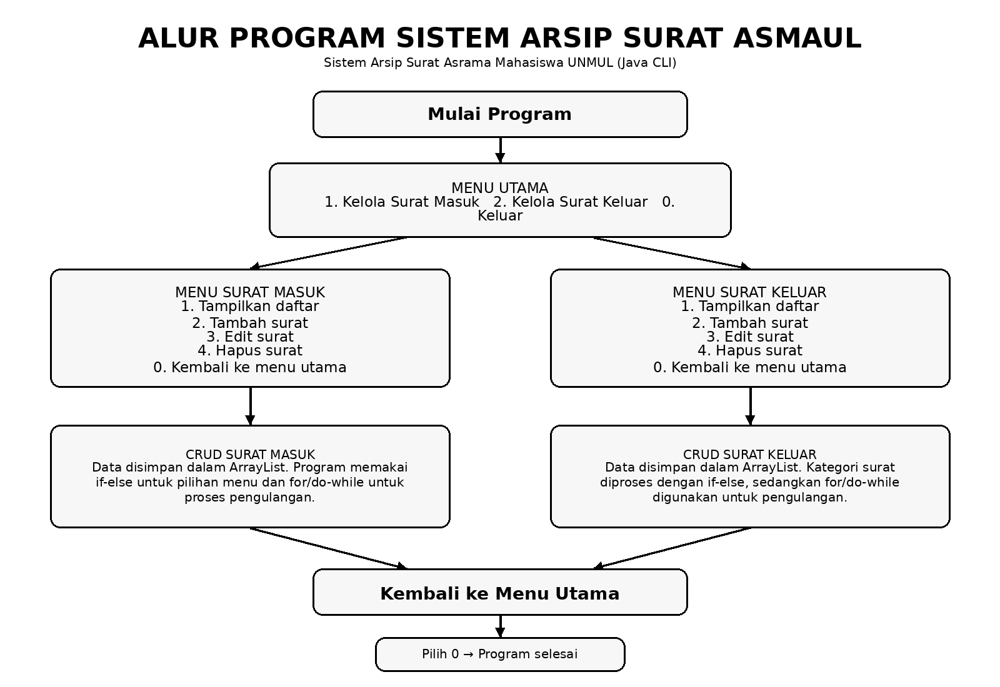

# Sistem Arsip Surat Asrama Mahasiswa UNMUL (ASMAUL)

## Identitas Mahasiswa

- **Nama:** Condrado Alain Sharon
- **NIM:** 2509116069
- **Kelas:** B - Sistem Informasi
- **Mata Kuliah:** Pemrograman Berorientasi Objek

## Deskripsi Studi Kasus
Sistem Arsip Surat Asrama Mahasiswa UNMUL (ASMAUL) adalah sistem yang dibuat dan dirancang menggunakan bahasa pemrograman Java.

Sistem ini dibuat untuk membantu proses pencatatan dan pengelolaan arsip surat di Asrama Mahasiswa Universitas Mulawarman. Sistem ini menjadi alternatif sederhana untuk menggantikan pencatatan arsip surat secara manual.

Aplikasi memiliki fitur pengelolaan surat masuk dan surat keluar dengan metode CRUD (*Create, Read, Update, Delete*).

Data surat disimpan menggunakan `ArrayList` selama program berjalan.

## Fitur Aplikasi

### 1. Pengelolaan Surat Masuk

- Menampilkan data surat masuk.
- Menambahkan data surat masuk.
- Mengedit data surat masuk.
- Menghapus data surat masuk.
- Kembali ke menu utama.

### 2. Pengelolaan Surat Keluar

- Menampilkan data surat keluar.
- Menambahkan data surat keluar.
- Mengedit data surat keluar.
- Menghapus data surat keluar.
- Kembali ke menu utama.

### 3. Menu Utama

- Memilih menu surat masuk.
- Memilih menu surat keluar.
- Keluar dari program.

## Alur Program

Program dimulai dari menu utama yang menyediakan pilihan untuk mengelola surat masuk, mengelola surat keluar, atau keluar dari program.

Pada menu surat masuk dan surat keluar, pengguna dapat melakukan proses menampilkan, menambah, mengedit, dan menghapus data. Data surat disimpan sementara menggunakan `ArrayList`.

Program menggunakan percabangan `if-else` untuk menentukan pilihan pengguna dan menggunakan perulangan `for` serta `do-while` agar menu dan proses pengelolaan data dapat dijalankan berulang kali.

## Struktur Class

Aplikasi ini memiliki beberapa class utama:

- `Surat` : Superclass yang menyimpan atribut umum surat.
- `SuratMasuk` : Subclass untuk mengelola data surat masuk.
- `SuratKeluar` : Subclass untuk mengelola data surat keluar.
- `ArsipSuratAsmaul` : Class utama (main) yang mengatur menu dan proses CRUD.

### 1. Menu Utama

Menu utama merupakan halaman pertama yang ditampilkan ketika program dijalankan. Pengguna dapat memilih tiga pilihan, yaitu `1` untuk mengelola surat masuk, `2` untuk mengelola surat keluar, dan `0` untuk keluar dari program.

### 2. Menu Surat Masuk

Pada saat masuk menu surat masuk, pengguna dapat memilih proses yang ingin dilakukan terhadap data surat masuk. Pilihan yang tersedia adalah `1` untuk menampilkan daftar surat, `2` untuk menambahkan surat, `3` untuk mengedit surat, `4` untuk menghapus surat, dan `0` untuk kembali ke menu utama.

### 3. Menampilkan Surat Masuk

Pada proses ini, program menampilkan seluruh data surat masuk yang tersimpan di dalam `ArrayList`. Program menggunakan perulangan untuk membaca setiap data surat dan menampilkan informasi berupa urutan surat, nomor surat, perihal, tanggal surat masuk, dan pengirim.

### 4. Menambahkan Surat Masuk

Pada proses penambahan surat masuk, pengguna akan memasukkan data surat secara berurutan. Data yang dimasukkan adalah nomor surat, perihal, tanggal masuk surat, dan nama pengirim. Setelah seluruh data dimasukkan, program membuat objek `SuratMasuk` berdasarkan data tersebut dan menyimpannya ke dalam `ArrayList`. Data tersebut kemudian dapat ditampilkan kembali melalui menu tampilkan surat masuk.

### 5. Mengedit Surat Masuk

Pada proses edit surat masuk, pengguna memilih data surat yang ingin diubah berdasarkan urutan surat. Setelah surat dipilih, pengguna kemudian dapat mengubah informasi surat seperti nomor surat, perihal, tanggal masuk surat, dan pengirim.

Setelah perubahan selesai dilakukan, data pada `ArrayList` diperbarui sehingga informasi surat yang ditampilkan sudah menggunakan data terbaru.

### 6. Menghapus Surat Masuk

Pada proses penghapusan surat masuk, pengguna memilih urutan surat yang ingin dihapus. Program kemudian mencari data berdasarkan urutan tersebut. Jika data ditemukan, program menghapus objek surat tersebut dari `ArrayList`. Setelah penghapusan berhasil, data surat yang telah dihapus tidak lagi ditampilkan pada daftar surat masuk.

### 7. Kembali dari Menu Surat Masuk

Pengguna dapat kembali dari menu surat masuk ke menu utama dengan memilih pilihan `0`. Program kemudian menghentikan perulangan pada menu surat masuk dan menampilkan kembali menu utama.

### 8. Menu Surat Keluar

Pada menu surat keluar, pengguna dapat memilih proses yang ingin dilakukan terhadap data surat keluar. Pilihan yang tersedia adalah `1` untuk menampilkan daftar surat, `2` untuk menambahkan surat, `3` untuk mengedit surat, `4` untuk menghapus surat, dan `0` untuk kembali ke menu utama.

### 9. Menampilkan Surat Keluar

Pada proses ini, program menampilkan seluruh data surat keluar yang tersimpan di dalam `ArrayList`. Informasi yang ditampilkan meliputi urutan surat, nomor surat, perihal, kategori surat, tanggal surat keluar, dan penerima. Program menggunakan perulangan untuk membaca setiap objek surat keluar yang tersimpan.

### 10. Menambahkan Surat Keluar

Pada proses penambahan surat keluar, pengguna diminta memasukkan beberapa data surat, yaitu kategori surat, perihal, tanggal surat keluar, dan penerima.

Pengguna kemudian memilih kategori surat berdasarkan pilihan yang tersedia. Program kemudian menggunakan kondisi `if-else` untuk menentukan kode kategori surat berdasarkan pilihan pengguna. Kode kategori kemudian dimasukkan dan dijadikan dasar untuk pembuatan nomor surat tersebut.

Setelah seluruh data dimasukkan, program membuat objek `SuratKeluar` dan menyimpannya ke dalam `ArrayList`.

### 11. Mengedit Surat Keluar

Pada proses edit surat keluar, pengguna memilih surat berdasarkan urutan surat yang ingin diubah.

Setelah surat ditemukan, pengguna dapat mengubah kategori surat, perihal, tanggal surat keluar, dan penerima. Program kemudian memperbarui data objek `SuratKeluar` yang tersimpan di dalam `ArrayList`.

### 12. Menghapus Surat Keluar

Pada proses penghapusan surat keluar, pengguna memilih urutan surat yang ingin dihapus. Program mencari data surat berdasarkan urutan tersebut.

Jika data ditemukan, objek surat akan dihapus dari `ArrayList`. Data tersebut kemudian tidak lagi muncul ketika daftar surat keluar ditampilkan.

### 13. Kembali dari Menu Surat Keluar

Pengguna dapat kembali dari menu surat keluar ke menu utama dengan memilih pilihan `0`. Program menghentikan perulangan pada menu surat keluar dan kemudian menampilkan kembali menu utama.

### 14. Keluar dari Program

Untuk mengakhiri program, pengguna memilih pilihan `0` pada menu utama. Program kemudian keluar dari perulangan menu utama dan menampilkan pesan bahwa program telah selesai.

## Penutup

Sistem Arsip Surat Asrama Mahasiswa UNMUL (ASMAUL) dibuat sebagai penerapan konsep dasar Pemrograman Berorientasi Objek menggunakan bahasa Java.

